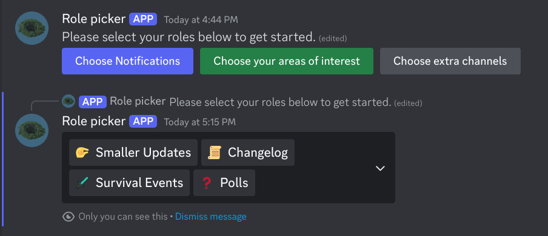

<div align="center">

# Discord role picker

</div>

A Discord bot using dropdown message components to let users pick roles defined in a config.



### Why this over Onboarding?

Discord does not let you enable new channels by default in onboarding. Once a user has gone through the onboarding process they need to manually toggle channels, which leads people to missing new channels entirely.

## Usage

### Docker compose

Quick setup with docker compose:
```yaml
services:
  discord-role-picker:
    image: ghcr.io/mineinabyss/discord-role-picker:latest
    environment:
      BOT_TOKEN: "YOUR_BOT_TOKEN"
    volumes:
      - ./config.yml:/app/config.yml
```

### Set up your bot

- Create the bot on Discord's developer portal, here's a [guide](https://discord.com/developers/docs/quick-start/getting-started) from them to get started.
- Add it to your server with permissions to read messages, send messages, and manage roles.
- Setup your bot with a config like below.
- Use `/rolesmessage` to create a message for your bot add role buttons to. Copy its id and channel id as shown in the config and restart. You can omit `role` in each config entry while testing.

### Config example

Part of the config we use on Mine in Abyss, this will show two buttons of different colors:

Style options are: `Primary`, `Secondary`, `Success`, `Danger`, `Link`
```yaml
infoText: "Some text on top of the button row"
rolesMessageReference:
  message: "" # Id of your message created by /rolesmessage
  channel: "" # The channel id it's in
groups:
  - id: notifications
    name: Choose Notifications
    style: Primary
    options:
      - name: Smaller Updates
        desc: Extra announcements that don't deserve an @everyone
        emoji:
          name: "\ud83e\udd0f"
        role: ...
      - name: Changelog
        desc: Every little server update
        role: ...
        emoji:
          name: "\ud83d\udcdc"
  - id: channels
    name: Choose extra channels
    style: Secondary
    options:
      - name: Manga
        desc: Manga discussions and spoilers
        role: ...
        emoji:
          name: "\ud83d\udcd6"
      - name: Welcome channel
        desc: See everyone that joins the server
        role: ...
        emoji:
          name: "\ud83d\udc4b"
```
 
### Outside Docker

We don't currently publish builds, but you can build a binary to the `build` folder using:

```
./gradlew installDist
```

The binary provides help instructions and needs Java 21+ to run.
